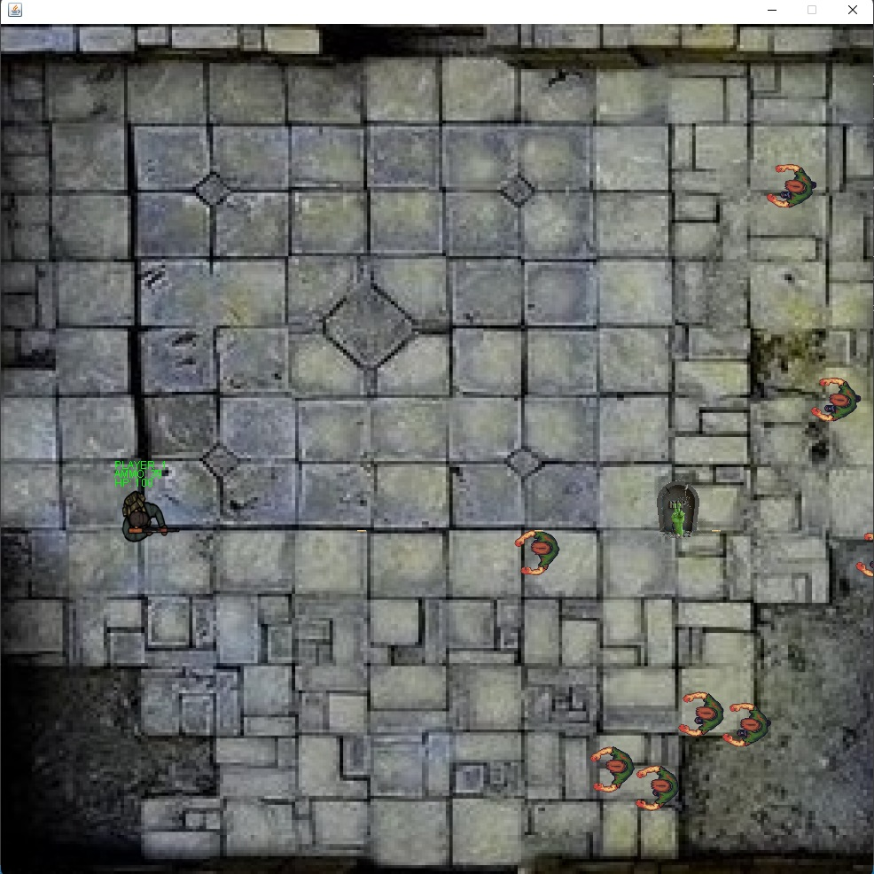

## GAME Project in JAVA

Hi there! This is a game made by me in Java.
This is a 2D top-down game, where the player must survive against zombies.



## Folder Structure

The workspace contains three folders, where:

- `src`: the folder to maintain sources
- `lib`: the folder to maintain dependencies

Meanwhile, the compiled output files will be generated in the `bin` folder by default.

To compile and run the game, you must have jdk and jre installed in your machine. It would be interesting if you have Visual Studio Code or IntelliJ also.

> If you want to customize the folder structure, open `.vscode/settings.json` and update the related settings there.

## How to run

Run the following commands from the root directory (Zombies/):

### Game

```
cd gameSrc
javac -d ../bin/ App.java
java -cp ../bin/ App
```

### Server

If runned the past commands, start a new terminal and run it, from the root directory (Zombies/):

```
cd mainServer
javac -d ./bin ServerApp.java
java -cp ./bin/ ServerApp
```

## Messages Shared

| Id  | Momento                         | Nome da Mensagem       | Remetente | Destinatário | Descrição da Mensagem                                                                                  |Implementado|
| --- | ------------------------------- | ---------------------- | --------- | ------------ | -------------------------------------------------------------------------------------------------------|-------------|
| 1   | Abrir o Jogo                    | Initial Connection     | Cliente   | Servidor     | Ao abrir o jogo, o cliente informa ao servidor.                                                        |     ✅      |
| 2   | Abrir o Jogo                    | Connection Initialized | Servidor  | Cliente      | O servidor da um OK em resposta a mensagem 1.                                                          |     ✅      |
| 11  | Antes de Iniciar o Jogo (Lobby) | Try to Play            | Servidor  | Cliente      | Se uma partida estiver em andamento e um player tentar ingressar no jogo, o servidor diz ao ingressante que ele não pode jogar.|  ✅  |                  
| 3   | Antes de Iniciar o Jogo (Lobby) | Ready to Play          | Cliente   | Servidor     | Quando o jogador apertar o botão de "pronto".                                                          |     ✅      |
| 4   | Antes de Iniciar o Jogo (Lobby) | Start Game             | Servidor  | Cliente      | Indica que todos os clientes podem inciar o jogo. Esta só é enviada quando todos os clientes mandarem a mensagem 3 para o servidor.|  ✅  |
| 5   | Durante o Jogo                  | Add Zombie             | Servidor  | Cliente      | Envia a posição de cada zumbi a ser spawnado. Esta mensagem é enviada a cada 1000 ms. A primeira mensagem é enviada imediatamente após a mensagem 4.|  ✅ |
| 6   | Durante o Jogo                  | Situation              | Cliente   | Cliente      | A ação ocorrida (movimentação, recarregar, atirar etc). Esta mensagem é enviada sempre que ocorrer uma ação. Caso não ocorra, nada é enviado.|  ✅  |
| 7   | Durante o Jogo                  | Active                 | Cliente   | Servidor     | O cliente informa ao servidor que ainda está ativo. Esta mensagem é enviada a cada y segundos.         |      ❌      |
| 8   | Durante o Jogo                  | Still Active?          | Servidor  | Cliente      | Se o cliente deixar de enviar a mensagem 7 por mais de 3y segundos, então, o servidor pergunta ao cliente que não está enviando a mensagem 7 se ele ainda está ativo. Se o cliente não responder ao servidor com uma mensagem 7, após a pergunta (mensagem 8) com limite de 3y segundos, o Servidor tira da lista de IPs ativos e encerra o socket daquele cliente. |      ❌      |
| 9   | Encerrando o Jogo               | End Connection         | Cliente   | Servidor     | Ao fechar o jogo, o cliente informa para fechar a conexão. Os sockets do servidor e do cliente são encerrados sem mais mensagens para confirmação.|  ✅  |
| 10  | Encerrando o Jogo               | Player Left the Game   | Servidor  | Cliente      | Após receber uma mensagem 9, o servidor informa ao(s) outro(s) cliente(s) que um cliente encerrou o jogo e deve ser removido da partida.|  ❌  |
